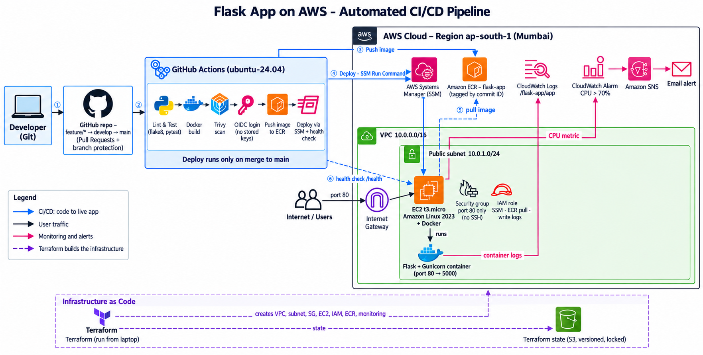
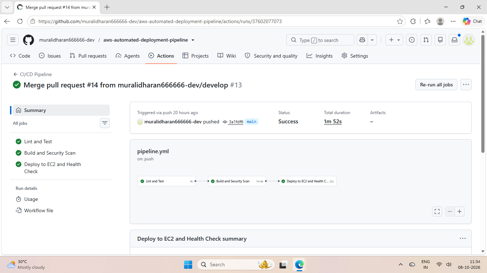
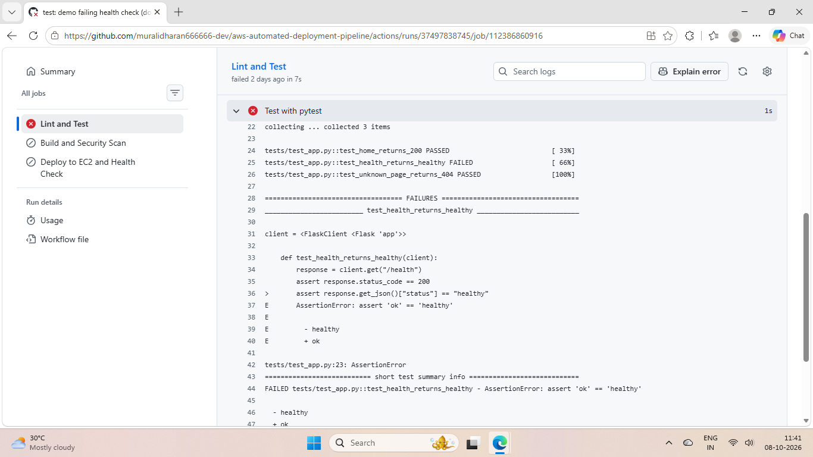
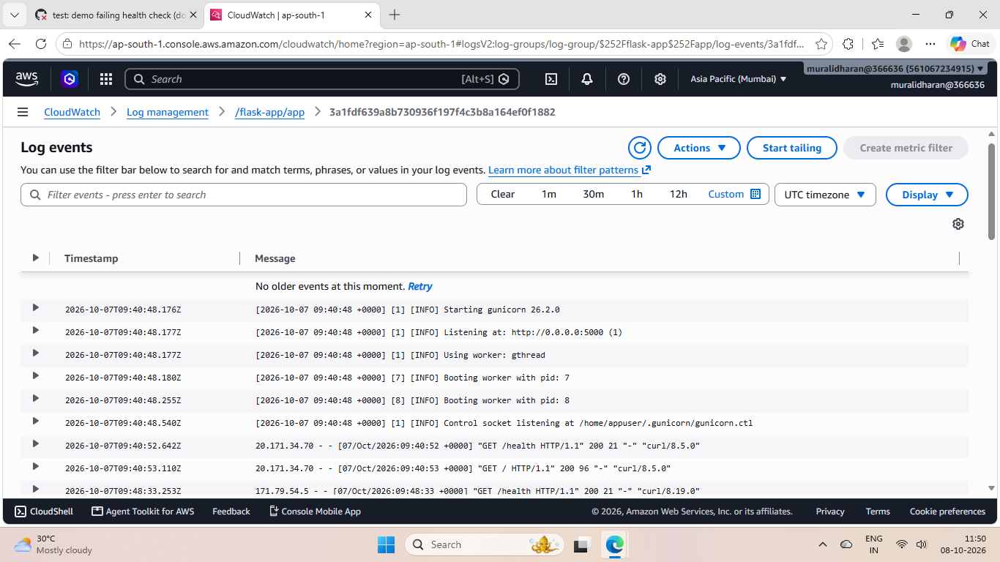
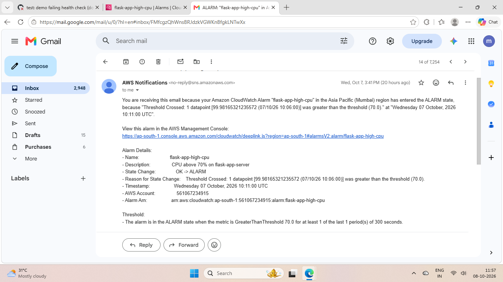

# Deployment of a Flask App with an Automated CI/CD Pipeline on AWS

[](https://github.com/muralidharan666666-dev/aws-automated-deployment-pipeline/actions/workflows/pipeline.yml)


Every merge to `main` is checked, tested, built into a Docker image, scanned for security issues, stored in Amazon ECR and deployed to EC2. Then the pipeline checks that the live app is healthy and running that exact commit. No AWS keys are stored in GitHub, there's no SSH, and the infrastructure is Terraform.

| **1m 52s** | **0** | **19** | **~3 min** |
|:---:|:---:|:---:|:---:|
| merge to live app | HIGH/CRITICAL vulnerabilities (Trivy) | AWS resources in Terraform | high CPU to email in my inbox |

> **Status:** torn down with `terraform destroy` after testing, to keep the cost at zero. Everything below comes from real runs, and the screenshots are in [`screenshots/`](screenshots/).

**Contents:** [Architecture](#architecture) · [What I built](#what-i-built) · [Proof it works](#proof-it-works) · [Problems I ran into](#problems-i-ran-into) · [The pipeline](#the-pipeline) · [Security](#security) · [Monitoring](#monitoring) · [Decisions](#design-decisions) · [Runbook](#runbook) · [Cost](#cost) · [Limitations](#known-limitations) · [What I learned](#what-i-learned)

---

## Architecture



```
Developer ─ feature/* ─► PR ─► develop ─► PR ─► main
                       (checks only)    (checks + deploy)

GitHub Actions (ubuntu-24.04)
  Lint & Test ─► Docker build ─► Trivy scan ─► OIDC login ─► push to ECR ─► SSM deploy ─► health + version check

AWS ap-south-1 (all Terraform, state in S3)
  VPC 10.0.0.0/16 ─ public subnet 10.0.1.0/24 ─ internet gateway
    EC2 t3.micro (Amazon Linux 2023 + Docker)
      └─ container: Gunicorn + Flask, port 80 → 5000
    Security group: inbound port 80 only, no SSH
    IAM role: SSM + pull from ECR + write to one log group
  ECR flask-app (immutable tags) · CloudWatch Logs /flask-app/app · CPU alarm → SNS → email
```

---

## Why I built this

My earlier projects were mostly about building infrastructure. This time I wanted the other half of the job: getting code from a commit to a running server automatically, the way a team would do it. So that means a Git workflow with pull requests, a Docker image, a pipeline that tests, scans and deploys, Terraform for the servers, and monitoring so I'd know when something breaks.

---

## What I built

| Area | What I did | Proof |
|---|---|---|
| **Git** | `main`, `develop` and `feature/*` branches, a PR template, branch protection with 2 required checks and no bypass, even for me | 14 pull requests while building it |
| **Docker** | Multi-stage build on `python:3.12-slim`, runs as a non-root user, Gunicorn with 2 workers × 4 threads | 50 MB image, 0 vulnerabilities |
| **AWS** | EC2 in my own VPC, only port 80 open, deployed over SSM instead of SSH | Live app showing the commit it runs |
| **CI/CD** | GitHub Actions: lint and test → build → Trivy → ECR → deploy → health check | 1m 52s from merge to live |
| **Terraform** | VPC, subnet, internet gateway, route table, security group, EC2 and its IAM role, ECR and the monitoring, with remote state in S3 and locking | 19 resources. `plan` still clean a day later |
| **Monitoring** | Container logs in CloudWatch (one stream per commit), a `/health` endpoint, a CPU alarm that emails me | ALARM email 3 minutes after I loaded the CPU |

---

## Proof it works

| The full pipeline on a merge to `main` | A broken test blocks the merge |
|:---:|:---:|
|  |  |
| **Container logs in CloudWatch** | **The CPU alarm reaching my inbox** |
|  |  |

<details>
<summary><b>More screenshots</b></summary>

| Screenshot | Shows |
|---|---|
| [05-alarm-graph.png](screenshots/05-alarm-graph.png) | CPU spike to 100%, the alarm going red and then back to OK |
| [06-ok-email.png](screenshots/06-ok-email.png) | The "back to OK" email |
| [07-trivy-scan.png](screenshots/07-trivy-scan.png) | Trivy: 0 vulnerabilities in Debian 13.7 and every Python package |
| [08a-branch-protection.png](screenshots/08a-branch-protection.png) | PR required before merging into `main` |
| [08b-required-checks.png](screenshots/08b-required-checks.png) | The 2 required checks: Lint and Test, Build and Security Scan |
| [08c-no-bypass.png](screenshots/08c-no-bypass.png) | "Do not allow bypassing", so the rules apply to admins too |
| [09-ecr-images.png](screenshots/09-ecr-images.png) | Images tagged by commit SHA, pulled about 20 s after each push |
| [10-ec2-tags.png](screenshots/10-ec2-tags.png) | `ManagedBy = terraform` and the `Project` tag the deploy role checks |
| [11-ec2-inbound-rules.png](screenshots/11-ec2-inbound-rules.png) | One inbound rule: port 80. No SSH |
| [12-terraform-plan-drift.png](screenshots/12-terraform-plan-drift.png) | A day later: drift detected (server stopped), no infrastructure changes |
| [13-live-app.png](screenshots/13-live-app.png) | The live app returning its commit SHA as the version |
</details>

- **The gate works.** I broke `/health` on purpose in PR #10. pytest failed with `assert 'ok' == 'healthy'`, the build and deploy were skipped, and the merge button stayed grey. I closed it without merging.
- **The deploy proves which code is live.** The health check doesn't stop at "healthy". It also checks that the home page returns this run's commit SHA, and fails the run if it doesn't.
- **The alarm works.** I loaded both vCPUs for 12 minutes. The alarm went to ALARM at 99.98% and emailed me, then sent an OK email once the load stopped.
- **It survives a restart.** I stopped and started the server. Docker and the container came back on their own, with the same version and no redeploy.
- **Terraform still matched a day later.** `terraform plan` noticed the server had been stopped (its public IP was gone) and proposed no changes to any real resource.

---

## Problems I ran into

Three real problems from this build and how they were fixed. All seven are in [docs/INCIDENTS.md](docs/INCIDENTS.md).

**1. The pipeline couldn't log in to AWS**
- **Symptom:** `Not authorized to perform sts:AssumeRoleWithWebIdentity`. Re-running didn't help.
- **Cause:** CloudTrail (AWS's record of every API call) showed the exact ID that GitHub sent: `repo:muralidharan666666-dev@226997318/aws-automated-deployment-pipeline@1404309788:ref:refs/heads/main`. GitHub adds permanent ID numbers for the owner and the repo. My role's trust policy (the rule saying who may use the role) only had the names, so it never matched.
- **Fix:** I put that exact ID into the trust policy, and the login worked.
- **Lesson:** When a login to an AWS role fails, CloudTrail shows exactly what was rejected.

**2. My `.gitignore` wasn't ignoring anything**
- **Symptom:** `__pycache__` files got committed, and came straight back after `git rm --cached`.
- **Cause:** Every line in `.gitignore` started with 2 hidden spaces, from pasting indented text. Git saw `  __pycache__/` as a different name, so nothing on the list was ignored, including `.env` and `*.pem`.
- **Fix:** I rewrote the file with `printf` (exact text, no hidden spaces) and stopped Git tracking the cache files.
- **Lesson:** Read the PR's "Files changed" tab before merging. Anything unexpected there is a warning.

**3. Hidden Windows line endings could have rebuilt my server**
- **Symptom:** `git status` showed five `.tf` files as modified when I hadn't touched them.
- **Cause:** Windows ends each line with two hidden characters, and Linux uses one. Git for Windows writes the Windows kind to the laptop. My EC2 start-up script lives inside `ec2.tf`, and that setting rebuilds the server if the script changes, even by one hidden character.
- **Fix:** I added a `.gitattributes` file (`*.tf text eol=lf`), so Terraform files always keep Linux line endings, on any laptop.
- **Lesson:** Fix it in the repo, not on each laptop.

---

## The pipeline

| Stage | What happens | Fails the run if |
|---|---|---|
| **Trigger** | Every PR into `develop` or `main` runs the checks. A push to `main` runs everything | — |
| **Lint and Test** (9 s) | `flake8` and 3 `pytest` tests | Any lint error or failing test |
| **Build and Security Scan** (1m 8s) | `docker build` tagged with the commit SHA, then Trivy (CRITICAL/HIGH, fixable only). On `main`: OIDC login and push to ECR | Any HIGH or CRITICAL vulnerability with a fix available |
| **Deploy to EC2** (22 s) | Finds the server by its `Name` tag, then SSM Run Command: pull the image, replace the container, prune old images | The SSM command doesn't end in `Success` |
| **Health check** | `/health` up to 10 times, 6 s apart, then the home page must show this commit's SHA | Not healthy, or the wrong version is live |

The deploy job only runs on a push to `main`. On PRs it shows as skipped. A concurrency group stops two deploys running at the same time. Changes that only touch docs don't trigger a deploy.

<details>
<summary><b>Show the deploy commands the server runs</b></summary>

```bash
aws ecr get-login-password --region ap-south-1 | docker login --username AWS --password-stdin <registry>
docker pull <registry>/flask-app:<commit-sha>
docker rm -f flask-app || true
docker run -d --name flask-app --restart unless-stopped -p 80:5000 \
  --log-driver awslogs --log-opt awslogs-region=ap-south-1 \
  --log-opt awslogs-group=/flask-app/app --log-opt awslogs-stream=<commit-sha> \
  -e APP_VERSION=<commit-sha> <registry>/flask-app:<commit-sha>
docker image prune -af
```
</details>

---

## Security

| Layer | What I did |
|---|---|
| **No stored AWS keys** | GitHub logs in with OIDC: a short-lived login that expires by itself, so there are no keys to steal. The role only accepts this repo's `main` branch |
| **The pipeline can only do its job** | Push to the `flask-app` ECR repo only. `ssm:SendCommand` only on instances tagged `Project = aws-automated-deployment-pipeline`, and only with the `AWS-RunShellScript` document |
| **No SSH** | No port 22, no key pair. Deploys and admin access go through SSM |
| **Network** | One security group: inbound port 80 only |
| **Server** | IMDSv2 required (blocks a known way of stealing the server's credentials), encrypted disk, an IAM role that can pull from ECR, use SSM and write to one log group |
| **Container** | Runs as a non-root user (`appuser`, uid 1000) from a slim base image |
| **Third-party tools** | Trivy is pinned to an exact commit, not a version tag. Attackers moved trivy-action's tags to bad code in March 2026, but a commit can't be moved. ECR tags can't be overwritten either |
| **Repo** | Branch protection with required checks and no bypass. `.env`, `*.pem`, `*.tfvars` and the Terraform state are gitignored. My alert email lives in a gitignored `terraform.tfvars` |

---

## Monitoring

| What | How |
|---|---|
| **Metrics** | EC2 basic monitoring: CPU, network and status checks every 5 minutes (free, no agent) |
| **Health** | `/health` returns `200 {"status":"healthy"}`, checked by the pipeline after every deploy |
| **Logs** | Docker's `awslogs` driver ships Gunicorn's logs to `/flask-app/app`, kept 7 days, one stream per commit SHA. `docker logs` still works on the box |
| **Alert** | Average CPU above 70% over 5 minutes → ALARM → SNS → email. It also emails when it recovers |

About two hours after launch, my access logs showed a bot trying more than a dozen WordPress and PHP pages in about 3 seconds (`/wp-admin/...`, `/archive.php`). Every request got a 404: the app only has `/` and `/health`, only port 80 is open, and there's no SSH. If I'd kept those logs only on the server, they'd have gone with it. That's why they go to CloudWatch.

---

## Design decisions

| Decision | Alternatives | Why | Trade-off |
|---|---|---|---|
| Deploy with SSM Run Command | SSH with a key in GitHub Secrets | No port 22, no key to leak | Needs the SSM agent and an IAM role |
| OIDC for the pipeline | Access keys in GitHub Secrets | Short-lived credentials, nothing to rotate or leak | The trust policy has to be exact (see problem 1) |
| Tag images with the commit ID, and don't allow overwriting | `latest` | Every image matches exact code, and old versions stay safe | "Re-run all jobs" fails, because that tag already exists |
| One EC2 + Docker | ECS, or an ALB with Auto Scaling | Matches the brief and stays cheap | One server, a few seconds of downtime per deploy |
| Terraform from my laptop, separate from the app pipeline | Terraform inside the pipeline | Changing infrastructure is riskier than changing code, so I kept them apart | Applies depend on my laptop and my IAM user |
| S3 state with `use_lockfile` | Local state, or DynamoDB locking | Survives a lost laptop. DynamoDB locking is deprecated | The bucket has to be made by hand first |
| Monitoring in Terraform | Clicking it in the console | One `destroy` removes it all, and no hand edits on a Terraform-built role | More code for small things |

The longer reasoning behind each one is in [docs/DECISIONS.md](docs/DECISIONS.md).

---

## Runbook

<details>
<summary><b>Deploy from scratch</b></summary>

One-time setup, done by hand:
1. An S3 bucket for Terraform state, with versioning on
2. The GitHub OIDC provider in IAM, plus a deploy role trusted only by this repo's `main` branch (permissions as in [Security](#security))

Then:
```bash
cd terraform
cp terraform.tfvars.example terraform.tfvars   # put your alert email in it
terraform init
terraform plan -out=tfplan                     # expect 19 to add, 0 to destroy
terraform apply tfplan
```
Confirm the SNS email. Then merge anything into `main`, and the pipeline deploys the app.
</details>

<details>
<summary><b>Validate</b></summary>

```bash
curl -i http://<public-ip>/health                       # HTTP/1.1 200 OK
aws ssm describe-instance-information --region ap-south-1 \
  --query "InstanceInformationList[].[InstanceId,PingStatus]" --output text   # Online
MSYS_NO_PATHCONV=1 aws logs tail /flask-app/app --region ap-south-1 --since 15m
aws cloudwatch describe-alarms --region ap-south-1 --alarm-names flask-app-high-cpu \
  --query "MetricAlarms[].StateValue" --output text      # OK
```
</details>

<details>
<summary><b>Rollback</b></summary>

There's no automatic rollback. I roll forward instead: `git revert` the bad merge on a branch, open a PR, merge it, and the pipeline ships a new image with the old code. The older images stay in ECR under their commit SHAs, so I can also run one by hand through SSM if I need to.
</details>

<details>
<summary><b>Cleanup</b></summary>

```bash
cd terraform && terraform destroy     # 19 resources. ECR has force_delete, so its images go too
```
Then by hand: empty and delete the state bucket (including old versions), and delete the deploy role. I kept the OIDC provider, because roles from my other projects use it too.
</details>

---

## Cost

| Item | If left running 24/7 |
|---|---|
| EC2 t3.micro (Mumbai) | ~$8 / month |
| Public IPv4 address | ~$3.6 / month |
| 8 GB gp3 disk | ~$0.7 / month |
| ECR, CloudWatch Logs and alarm, SNS email, S3 state | Cents |

That comes to roughly $12–13 a month if it ran all the time. I stopped the server between sessions and destroyed everything at the end.

---

## Known limitations

Choices I made for a portfolio project, and what production would need.

- **No HTTPS.** Port 80 only. HTTPS needs a domain and an ACM certificate, and I don't own a domain.
- **One server.** Each deploy removes the old container before starting the new one, so there are a few seconds of downtime. Production would put two or more instances behind a load balancer, or use ECS with rolling deploys.
- **No automatic rollback.** A failed health check fails the run, but it doesn't put the previous version back.
- **The public IP changes on every stop and start.** The pipeline looks it up each time. A real setup would use a load balancer or a domain.
- **Terraform runs from my laptop** with my own IAM user. A separate Terraform pipeline, with plan on PR and apply after approval, would remove that.
- **The alarm fires after a single 5-minute period.** Good for testing. Production would use 2–3 periods, and also alarm on `CPUCreditBalance`, because a t3 in standard mode drops to 10% CPU when its credits run out.
- **No memory or disk metrics.** Those need the CloudWatch agent inside the instance.
- **Some read permissions are account-wide.** `ec2:DescribeInstances` and reading SSM results can't be narrowed much by resource.

---

## What I learned

Before this, "CI/CD" mostly meant a green tick to me. Now I think of the pipeline as a set of gates, and a gate isn't worth trusting until I've watched it stop something. That's why I broke my own health check, and why I made the CPU busy on purpose to test the alarm.

The biggest thing that clicked was who does what. Terraform is the builder: it puts up the shop once. The pipeline is the delivery van: every merge, it brings new goods to the same shop and swaps them on the shelf. It never builds a new server. When I moved from my hand-built setup to Terraform, the pipeline didn't need a single change, because it finds the server by its tag, not by an ID.

And most of my real problems weren't in AWS at all. They were hidden spaces in a file, Windows line endings, and a CLI pointing at the wrong region. Reading the actual error, and the actual logs (CloudTrail for the login problem), is what fixed every one of them.

---

## Repo structure

```
├── app.py                        # Flask app: / and /health
├── tests/test_app.py             # 3 pytest tests
├── Dockerfile                    # multi-stage, non-root
├── requirements.txt / requirements-dev.txt
├── .github/
│   ├── workflows/pipeline.yml    # the CI/CD pipeline
│   └── pull_request_template.md
├── terraform/
│   ├── versions.tf  variables.tf  outputs.tf
│   ├── network.tf  security.tf  ec2.tf  ecr.tf  monitoring.tf
│   └── terraform.tfvars.example
├── docs/                         # INCIDENTS.md, DECISIONS.md
└── screenshots/
```

Terraform 1.15.8 · AWS provider ~> 6.0 · ap-south-1

---

## Author

**Muralidharan M N**

AWS Certified Cloud Practitioner | HashiCorp Certified: Terraform Associate | AWS re/Start Graduate

LinkedIn: https://www.linkedin.com/in/muralidharan-m-n-78a2522b8

GitHub: https://github.com/muralidharan666666-dev
